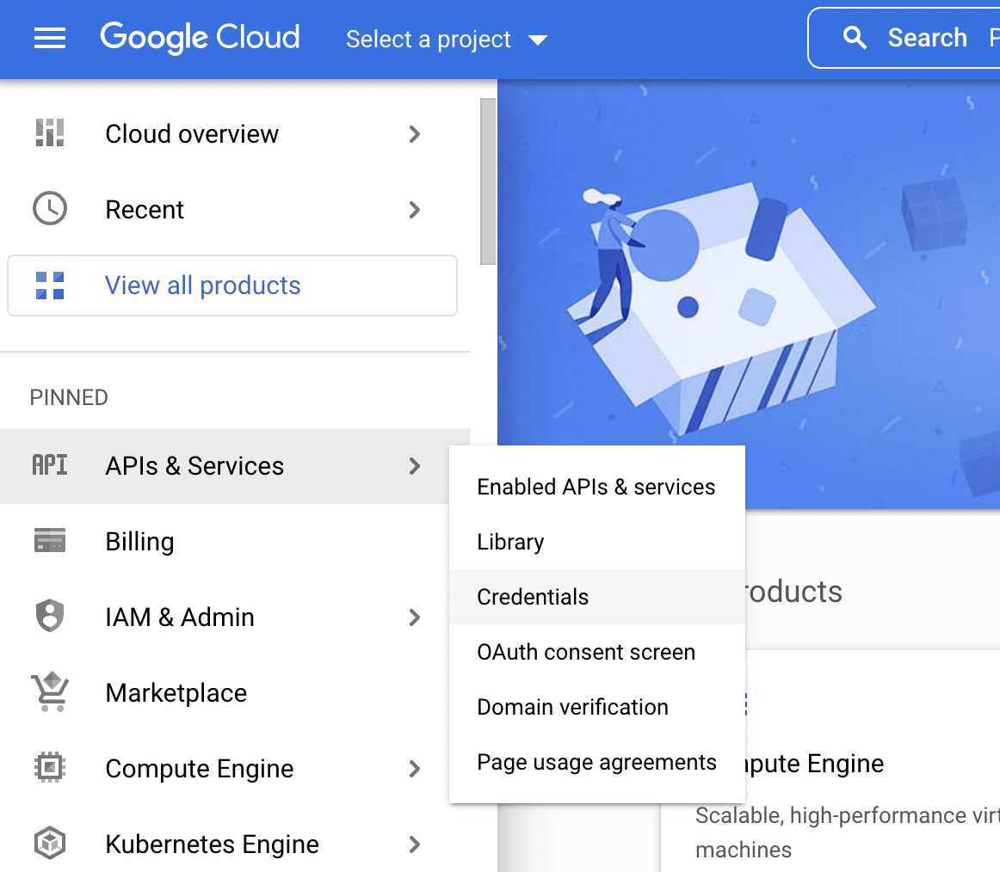
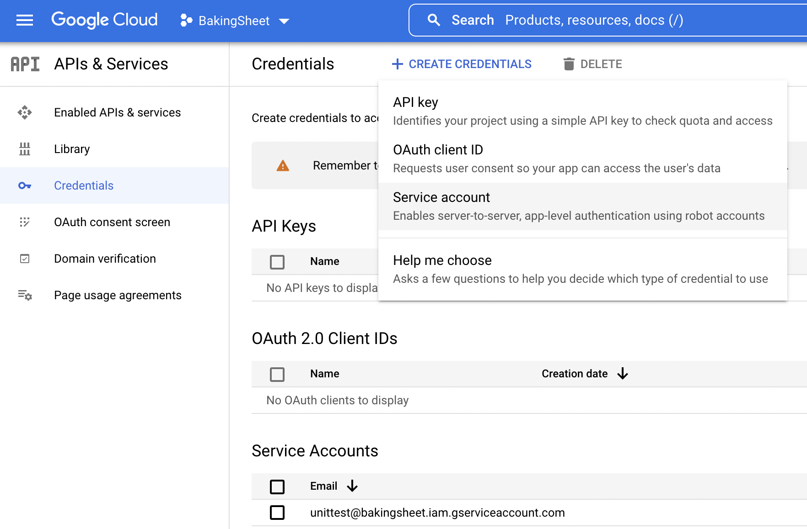
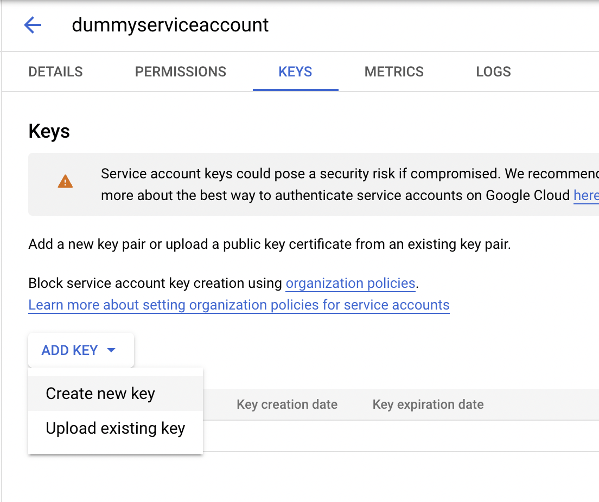
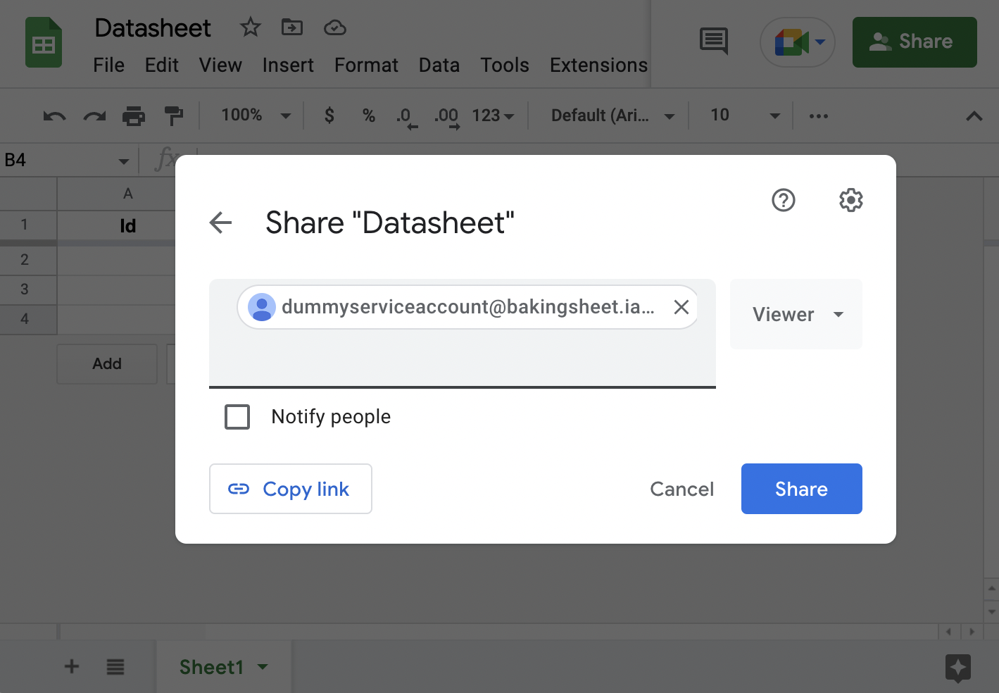
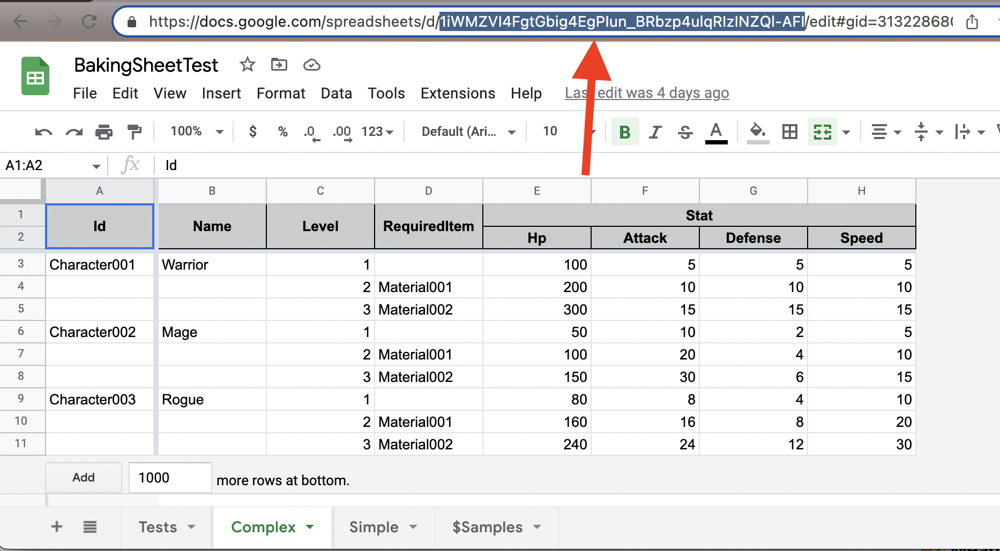

# BakingSheet.Converters.Google
This document will explain about how to connect to Google Sheet. For general information, see the [Repository's README](../README.md).

## How to Use Google Sheet Converter
To use `GoogleSheetConverter`, BakingSheet requires a service account credential and your sheet's identifier.

### Create Google Service Account
First, visit [Google API Console](https://console.cloud.google.com/). Pick `API & Services` > `Credentials` from sidebar menu.



Create project if you don't have any. Then pick `Create Credentials` > `Service Account`.



Now fill your preferred service account name for BakingSheet to use. Click `Done` (You don't have to fill other options).


### Get Service Account Credential
You've create service account, now click your new service account and select `Keys` tab. Pick `Add Key` > `Create New Key`.



Select `JSON` option to download your key. Save it somewhere under your `Assets` folder.

### Invite Service Account to your Google Sheet
You have Service Account, now create a Google Sheet and Share it to your service account email with `Viewer` permission.



### Get Your Sheet Identifier
From your browser's address bar, you can extract your Google Sheet identifier. The format is like this:
```
https://docs.google.com/spreadsheets/d/{spreadsheetId}/edit#gid=0
```


### Load from Google Sheet
Almost there! Now you can use code below to load your datasheet.

```csharp
// replace with your Google sheet identifier
string googleSheetId = "1iWMZVI4FgtGbig4EgPIun_BRbzp4ulqRIzINZQl-AFI";

// service account credential than can read the sheet you're converting
// this starts with { "type": "service_account", "project_id": ...
string googleCredential = File.ReadAllText("Some/Path/Credential.json");

var googleConverter = new GoogleSheetConverter(googleSheetId, googleCredential);

// bake sheets from google converter
await sheetContainer.Bake(googleConverter);
```
Nicely done! 🎉

## How to Load from Multiple Documents
`SheetContainer.Bake` can accept multiple importers. If you want to divide your datasheets into multiple Google Sheet documents, create `GoogleSheetImporter` per your document. Code below is the example.
```csharp
var credential = File.ReadAllText(CredentialPath);
var importers = new List<ISheetImporter>();

foreach (var address in GoogleSheetAddresses)
{
    var importer = new GoogleSheetConverter(address, credential, TimeZoneInfo.Utc);
    importers.Add(importer);
}

await sheetContainer.Bake(importers.ToArray());
```

## How to Use Google Sheet Converter on Runtime
> **Warning**  
> This is an advanced topic. I recommend you to use this approach Develop environment only, for live-reload without exporting sheet.

Since BakingSheet is an Embedded Package, you can edit the content of it. In Unity's Project view, go to folder `Packages/BakingSheet/Runtime/Converters/Google`. Set `BakingSheet.Google` assembly definition's Platforms to `Any Platform`. Also set all other `Google.*` dlls in same folder Platforms to `Any Platform`.

Now, copy the `link.xml` anywhere under `Assets` folder. You can use `GoogleSheetConverter` on runtime platforms now.
