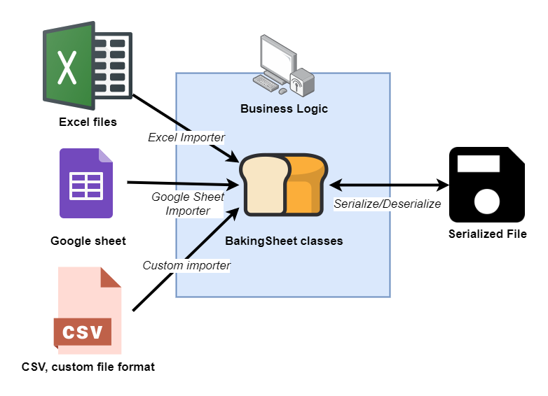

 

# BakingSheet
Easy datasheet management for C# and Unity

## Install
Download with [NuGet](https://github.com/cathei?tab=packages&q=BakingSheet) or download [.unitypackage release](https://github.com/cathei/BakingSheet/releases)

## Concept


BakingSheet's core concept is controlling datasheet schema from C# code, make things flexible while supporting multiple sources like .xlsx or Google sheets.
Also, it helps to avoid having source datasheet files or parsing libraries for production applications. BakingSheet supports JSON serialization by default.

## First Step
BakingSheet manages datasheet schema as C# code. `Sheet` class represents a table and `SheetRow` class represents a record. Below is example content of file `Items.xlsx`.
| Id             | Name              | Price |
|----------------|-------------------|-------|
| ITEM_LVUP001   | Warrior's Shield  | 10000 |
| ITEM_LVUP002   | Mage's Staff      | 10000 |
| ITEM_LVUP003   | Assassin's Dagger | 10000 |
| ITEM_POTION001 | Health Potion     | 30    |
| ITEM_POTION002 | Mana Potion       | 50    |

Code below is corresponding BakingSheet class.
```csharp
public class ItemSheet : Sheet<ItemSheet.Row>
{
    public class Row : SheetRow
    {
        // use name of matching column
        public string Name { get; private set; }
        public int Price { get; private set; }
    }
}
```
Note that `Id` column is already defined in base `SheetRow` class.

To represent collection of sheets, implement `SheetContainerBase` class.
```csharp
public class SheetContainer : SheetContainerBase
{
    public SheetContainer(Microsoft.Extensions.Logging.ILogger logger) : base(logger) {}

    // use name of each matching sheet name from source
    public ItemSheet Items { get; private set; }
}
```

## Importers
Importers are simple implementation extracts records from datasheet sources. These come as separated library, as it's user's decision to select datasheet source.
User can have converting process, to convert datasheet to serialized files ahead of time and not include importers in production applications.

BakingSheet supports two basic importers
* `BakingSheet.Importers.Excel`
* `BakingSheet.Importers.Google`

Below sample shows how to convert .xlsx files from `ExcelPath` directory.
```csharp
// pass logger to receive logs
var sheetContainer = new SheetContainer(logger);

// create excel importer from path
var excelImporter = new ExcelSheetImporter("ExcelPath");

// bake sheets from excel importer
await sheetContainer.Bake(excelImporter);
```

## Using Non-String Id Column

## Using Post Load Hook

## Using Cross-Sheet Reference

## Custom Importers

User can create and customize their own importer by implementing `ISheetImporter`.

## Custom Verifiers
You can verify datasheet sanity with custom verifiers. For example, you can define `ResourceAttribute` to mark columns that should reference path inside of Unity's Resources folder.
