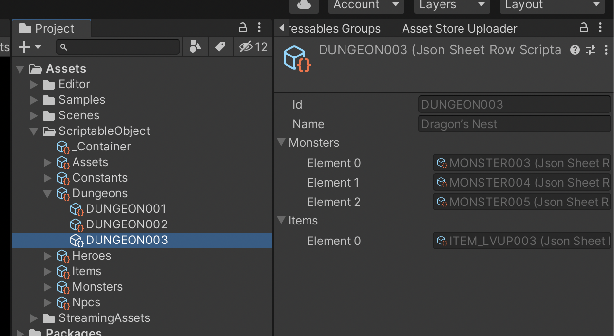
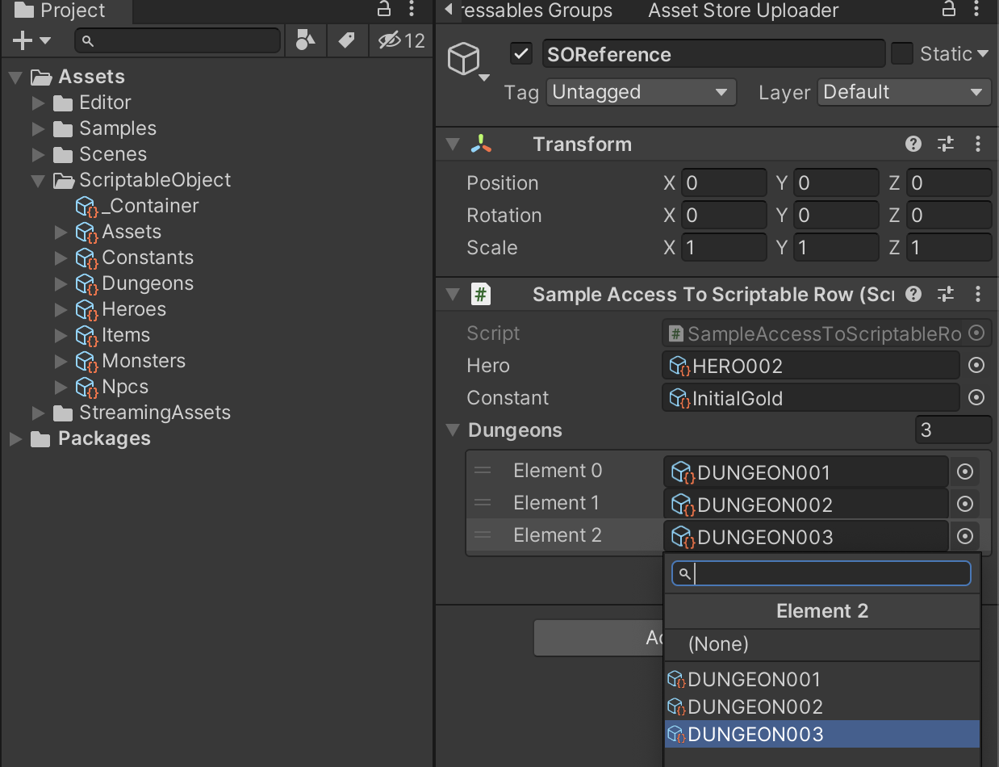
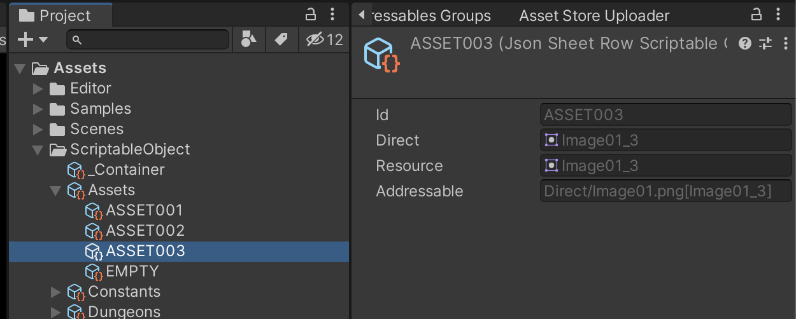

# Scriptable Object Converter
This document will explain about how to export and import Unity's Scriptable Object. For general information, see the [Repository's README](../README.md).

## Concept
ScriptableObject exporter and importer uses Unity's ScriptableObject asset as data container.
So you can inspect the data, reference specific row from MonoBehaviour, or even make it Addressable.

## Exporting Scriptable Object
You can create ScriptableObject assets using `ScriptableObjectExporter`.
The path is the base path of ScriptableObject will be saved, relative to project path.
```csharp
var exporter = new ScriptableObjectSheetExporter("Assets/ScriptableObject");

await sheetContainer.Store(exporter);
```
You can inspect each row from Unity's inspector.


## Importing Scriptable Object
You can import from ScriptableObject assets using `ScriptableObjectImporter`. A reference to `SheetContainerScriptableObject` is required.
```csharp
public class SheetManager : MonoBehaviour
{
    private SheetContainer container;
    public SheetContainerScriptableObject containerSO;

    public async void Start()
    {
        var importer = new ScriptableObjectSheetImporter(containerSO);

        container = new SheetContainer(UnityLogger.Default);
        await container.Bake(importer);
    }
}
```
You can drag-drop `_Container` ScriptableObject to your `SheetManager` component.

## Referencing Scriptable Object
You can use `Sheet.Reference` (Same as cross-sheet reference) to reference specific Row from inspector.

```csharp
public class SampleAccessToScriptableRow : MonoBehaviour
{
    public HeroSheet.Reference hero;
    public ConstantSheet.Reference constant;
    public List<DungeonSheet.Reference> dungeons;

    public void Awake()
    {
        Debug.Log(hero.Ref.Name);
        Debug.Log(constant.Ref.ValueInt);

        foreach (var dungeon in dungeons)
        {
            foreach (var item in dungeon.Ref.Items)
                Debug.Log(item.Ref.Name);
        }
    }
}
```

Note that while you can reference value of each row with this way, `PostLoad` will not be called until you import container with `ScriptableObjectImporter`.

## Using DirectAssetPath
`DirectAssetPath` will be automatically converted to asset reference when you export to ScriptableObject.



